# YiShape-VecDB (易形空间 向量数据库管理系统)

[](LICENSE)
[](https://www.oracle.com/java/technologies/downloads/)
[](https://github.com/ScaleFree-Tech/YiShape-VecDB)

> 易形空间 - 寓意通过灵活、丰富的空间变换，实现最优向量表征、向量索引与向量检索计算。

[English](#english) | [中文](#中文)

---

## 中文

### 项目简介

"易形空间向量数据库"系统是面向大语言模型、自然语言处理、图像检索等新型人工智能应用的专用数据库管理系统及场景应用辅助系统，拥有完全自主知识产权。系统的核心功能包括：非结构数据（文本、图像、语音）的最优向量空间表征算法（自研）和最速检索空间索引算法（自研），主要面向企业的私有化部署，适用于垂直领域企业内部海量私有数据的知识提炼。

系统使用JAVA开发，内部集成了DeepSeek、QWen等主流优质商用大模型，能通过Ollama在企业内网部署各类开源大模型，通过检索增强生成、图像分析与检索、大模型Agent等应用，并能够通过开放的API整合企业内部信息资源和企业部软件功能，实现传统业务的AI赋能。

本项目专注于"易形空间向量数据库"的专用图形化界面（Graphical User Interface, GUI）开发，免费使用。

### 系统演示

- [📖 系统演示地址](http://demo.yishape.com/mag/)

### 核心特性

#### 🔍 智能向量检索
- **多模态支持**: 支持文本、图像、语音等多种数据类型的向量化存储与检索
- **自研向量化方法**: 在GloVe、DistilBERT、ResNet等基础上进行距离度量学习，实现最优向量表征
- **高效索引技术**: 支持HNSW、E2LSH、扁平索引等多种向量索引方法
- **混合检索策略**: 结合BM25关键词检索和向量相似性检索，提供更精准的搜索结果

#### 🤖 大模型集成与RAG
- **多模型支持**: 集成DeepSeek、QWen、Ollama等主流大模型
- **检索增强生成**: 内置RAG功能，为大模型提供事实依据，缓解幻觉问题
- **智能问题解析**: 使用大模型解析用户意图，生成更精准的检索语句
- **连续对话支持**: 支持多轮对话中的上下文理解和检索

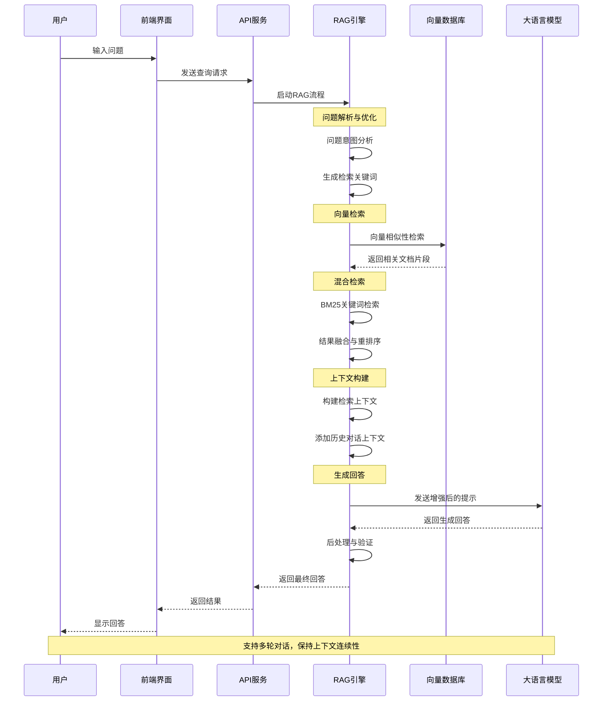

#### 🛠️ ReAct Agent框架
- **推理-行动循环**: 实现观察-思考-行动-再观察的智能决策循环
- **内置工具集**: 提供WEB搜索、天气预报、地理位置查询等丰富工具
- **多模态能力**: 支持图片生成、文件处理等多种外部功能调用
- **幻觉克服**: 通过本地数据检索和WEB搜索提供可核实依据

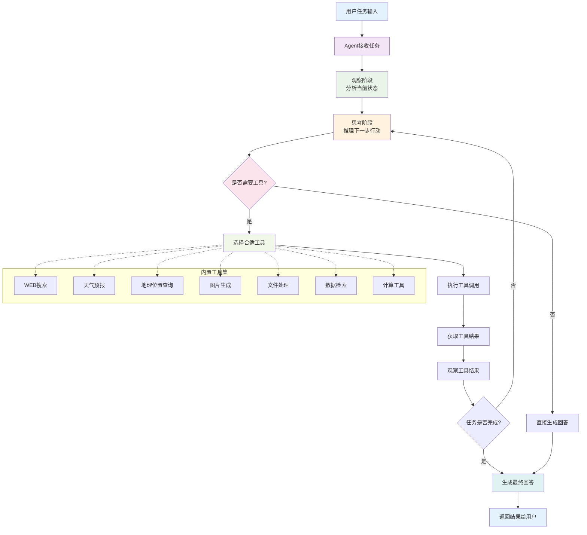

#### 📊 批量处理能力
- **文本块处理**: 支持大规模文本的智能分块和批量处理
- **文件迭代任务**: 实现批量论文阅读、文档分析等复杂任务
- **多语言支持**: 支持中英文混合检索和批量翻译
- **性能优化**: 支持GPU加速，提供高性能的向量计算能力

#### 🔧 企业级特性
- **私有化部署**: 支持企业内网部署，保护数据隐私
- **开放API**: 提供丰富的API接口，支持与现有系统集成
- **可扩展架构**: 支持自定义向量数据库和第三方软件平台集成
- **监控日志**: 完整的系统监控和日志记录功能

### 技术架构

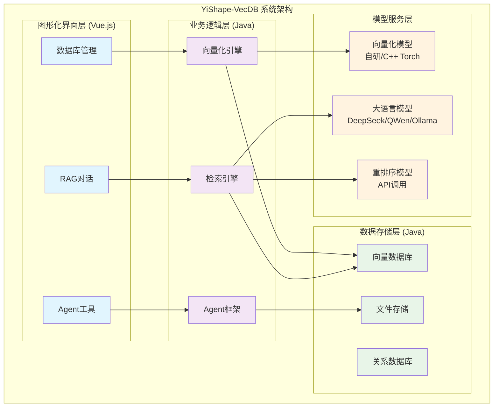

### 支持的文件类型

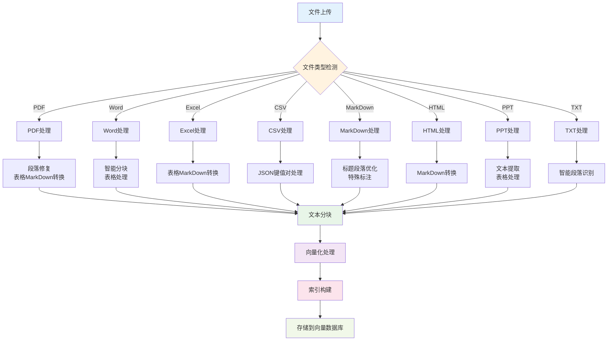

| 类型 | 扩展名 | 特殊处理 |
|------|--------|----------|
| PDF | .pdf | 段落修复、表格MarkDown转换 |
| Word | .doc/.docx | 智能分块、表格处理 |
| Excel | .xls/.xlsx | 表格MarkDown转换 |
| CSV | .csv | JSON键值对处理 |
| MarkDown | .md | 标题段落优化、特殊标注 |
| HTML | .html/.htm | MarkDown转换 |
| PPT | .ppt/.pptx | 文本提取、表格处理 |
| TXT | .txt | 智能段落识别 |

### 快速开始

#### 系统部署架构

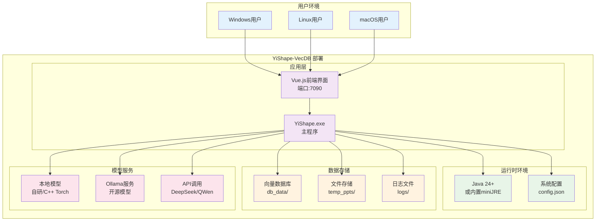

#### 系统要求
- Windows 10+ / Linux / macOS
- Java 24+ 或内置miniJRE
- 内存: 4GB+ (推荐8GB+)
- 存储: 10GB+ 可用空间

#### 安装步骤

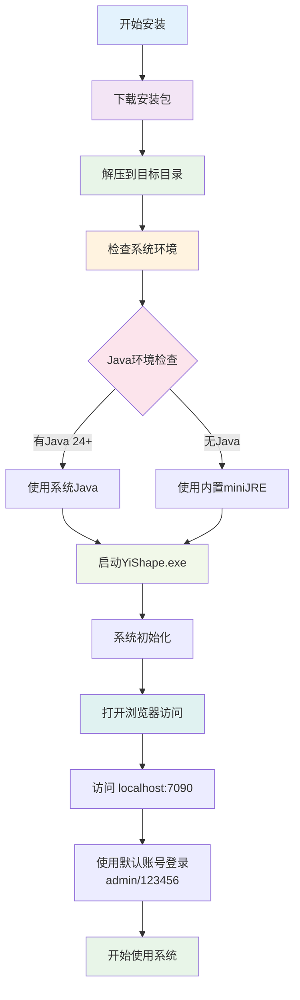

1. **下载安装包**
   ```bash
   # 下载最新版本
   wget https://github.com/ScaleFree-Tech/YiShape-VecDB/releases/latest/download/yi_shape_win64_vx.x.x.zip
   ```

2. **解压安装**
   ```bash
   unzip yi_shape_win64_vx.x.x.zip
   cd yi_shape_win64_vx.x.x
   ```

3. **启动系统**
   ```bash
   # Windows
   bin/YiShape.exe
   # 或双击bin/YiShape.exe启动程序
   
   ```

4. **访问系统**
   - 打开浏览器访问: `http://localhost:7090`（默认端口为7090）
   - 默认管理员账号: `admin`
   - 默认密码: `123456`

#### 快速配置

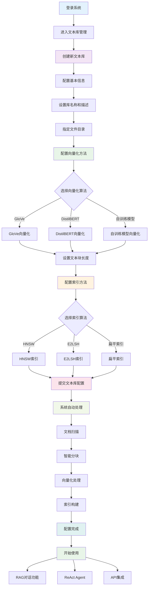

1. **创建文本库**
   - 进入"文本库管理"页面
   - 点击"新增文本库"
   - 配置库名称、描述、文件目录等基本信息

2. **配置向量化方法**
   - 选择向量化方法: GloVe、DistilBERT或自训练模型
   - 设置文本块长度限制
   - 配置索引方法: HNSW、E2LSH或扁平索引

3. **上传文档**
   - 将文档放入指定目录
   - 系统自动扫描、分块、向量化
   - 等待索引构建完成

4. **开始使用**
   - 使用RAG对话功能进行智能问答
   - 配置ReAct Agent实现复杂任务自动化
   - 通过API接口集成到现有系统

### 详细文档

- [📖 系统使用指南](bin/static/docs/main.md)
- [🔍 文本库配置说明](bin/static/docs/text_db.md)
- [🤖 RAG检索增强生成](bin/static/docs/rag.md)
- [🛠️ ReAct Agent框架](bin/static/docs/react_agent.md)
- [🔧 Agent工具集](bin/static/docs/agent_tools.md)
- [⚡ GPU性能优化](bin/static/docs/gpu.md)
- [📚 使用案例](bin/static/docs/cases/)

### 使用案例

- [🚀 快速建立海量文件文本库](bin/static/docs/cases/quick_start)
- [🌍 构建多语言论文资料库](bin/static/docs/cases/rag_with_multi_lang)
- [📝 批量英文资料翻译](bin/static/docs/cases/batch_tans_with_chunk_agent)
- [📖 批量论文阅读分析](bin/static/docs/cases/batch_paper_reading_with_file_agent)

### 贡献指南

我们欢迎所有形式的贡献！请查看 [CONTRIBUTING.md](CONTRIBUTING.md) 了解如何参与项目开发。

### 许可证

本项目采用 GPL-3.0 许可证 - 查看 [LICENSE](LICENSE) 文件了解详情。

### 联系我们

- 项目主页: [https://github.com/ScaleFree-Tech/YiShape-VecDB](https://github.com/ScaleFree-Tech/YiShape-VecDB)
- 问题反馈: [Issues](https://github.com/ScaleFree-Tech/YiShape-VecDB/issues)
- 功能建议: [Discussions](https://github.com/ScaleFree-Tech/YiShape-VecDB/discussions)

---

## English

### Project Overview

"YiShape Vector Database" is a specialized database management system and application assistance system for new artificial intelligence applications such as large language models, natural language processing, and image retrieval. The system has complete independent intellectual property rights. Its core functions include: optimal vector space representation algorithms (self-developed) and fastest retrieval space indexing algorithms (self-developed) for unstructured data (text, images, audio), mainly targeting enterprise private deployment, suitable for knowledge extraction from massive private data within vertical domain enterprises.

YiShape-VecDB internally integrates mainstream high-quality commercial large models such as DeepSeek and QWen, can deploy various open-source large models through Ollama in enterprise intranets, and realizes AI empowerment of traditional businesses through applications such as retrieval-augmented generation, image analysis and retrieval, and large model Agent, and can integrate enterprise internal information resources and enterprise software functions through open APIs.

This project focuses on the development of a dedicated graphical user interface (GUI) for the "YiShape-VecDB", and all the files are free to use.

### DEMO

- [📖 YiShape VecDB DEMO](http://demo.yishape.com/mag/)

### Technical Architecture

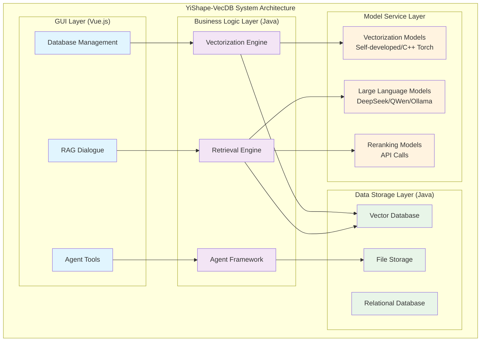

### Core Features

#### 🔍 Intelligent Vector Retrieval
- **Multi-modal Support**: Supports vectorized storage and retrieval of multiple data types including text, images, and audio
- **Optimized Vectorization Methods**: Based on GloVe, DistilBERT, ResNet, etc., distance metric learning is carried out to achieve the optimal vector representation.
- **Efficient Indexing Technology**: Supports multiple vector indexing methods including HNSW, E2LSH, and flat indexing
- **Hybrid Retrieval Strategy**: Combines BM25 keyword retrieval and vector similarity retrieval for more accurate search results

#### 🤖 Large Model Integration and RAG
- **Multi-model Support**: Integrates mainstream large models such as DeepSeek, QWen, and Ollama
- **Retrieval-Augmented Generation**: Built-in RAG functionality provides factual basis for large models and alleviates hallucination problems
- **Intelligent Question Parsing**: Uses large models to parse user intent and generate more accurate retrieval statements
- **Continuous Dialogue Support**: Supports context understanding and retrieval in multi-turn conversations

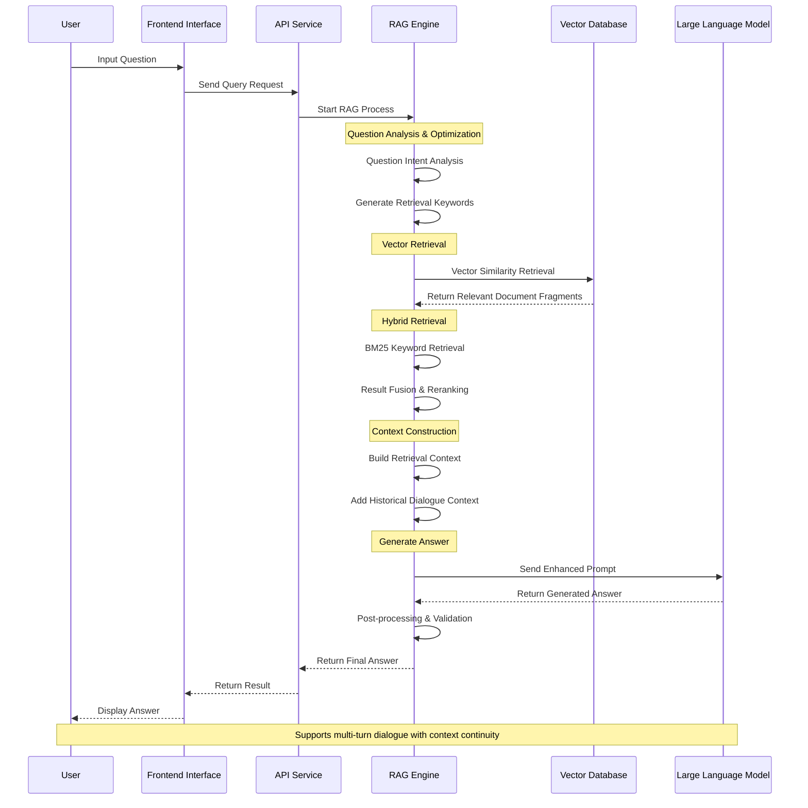

#### 🛠️ ReAct Agent Framework
- **Reasoning-Action Loop**: Implements intelligent decision-making cycles of observe-think-act-observe
- **Built-in Toolset**: Provides rich tools including WEB search, weather forecasting, and geographic location queries
- **Multi-modal Capabilities**: Supports various external function calls such as image generation and file processing
- **Hallucination Overcoming**: Provides verifiable basis through local data retrieval and WEB search

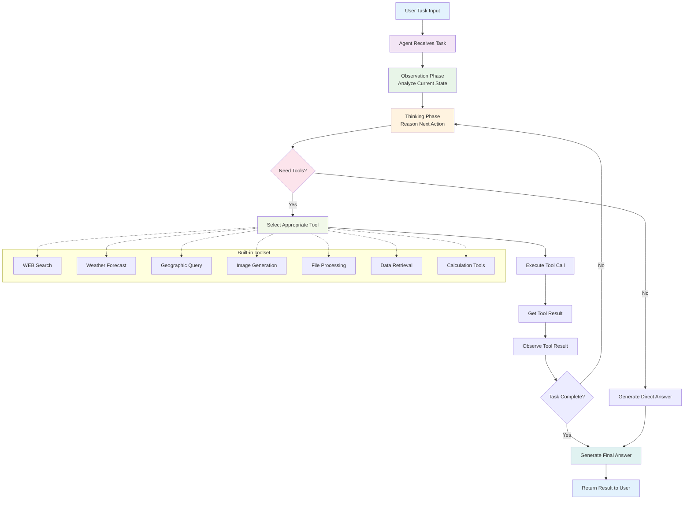

#### 📊 Batch Processing Capabilities
- **Text Chunk Processing**: Supports intelligent chunking and batch processing of large-scale texts
- **File Iteration Tasks**: Implements complex tasks such as batch paper reading and document analysis
- **Multi-language Support**: Supports mixed Chinese-English retrieval and batch translation
- **Performance Optimization**: Supports GPU acceleration for high-performance vector computing

#### 🔧 Enterprise Features
- **Private Deployment**: Supports enterprise intranet deployment to protect data privacy
- **Open APIs**: Provides rich API interfaces for integration with existing systems
- **Scalable Architecture**: Supports custom vector databases and third-party software platform integration
- **Monitoring and Logging**: Complete system monitoring and logging functionality

### Quick Start

#### System Deployment Architecture

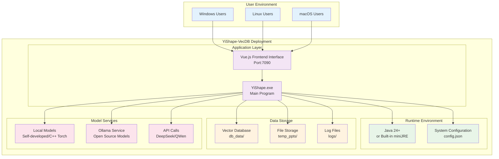

#### System Requirements
- Windows 10+ / Linux / macOS
- Java 24+ or built-in miniJRE
- Memory: 4GB+ (recommended 8GB+)
- Storage: 10GB+ available space

#### Installation Steps

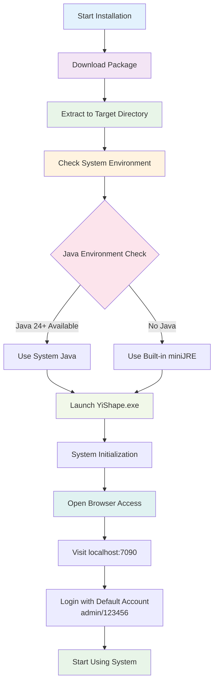

1. **Download Package**
   ```bash
   # Download latest version
   wget https://github.com/ScaleFree-Tech/YiShape-VecDB/releases/latest/download/yi_shape_win64_vx.x.x.zip
   ```

2. **Extract and Install**
   ```bash
   unzip yi_shape_win64_vx.x.x.zip
   cd YiShape-VecDB
   ```

3. **Start System**
   ```bash
   # Windows
   bin/YiShape.exe
   # or double-click bin/YiShape.exe

   ```

4. **Access System**
   - Open browser and visit: `http://localhost:7090`(The default port is 7090)
   - Default admin account: `admin`
   - Default password: `123456`

#### Supported File Types

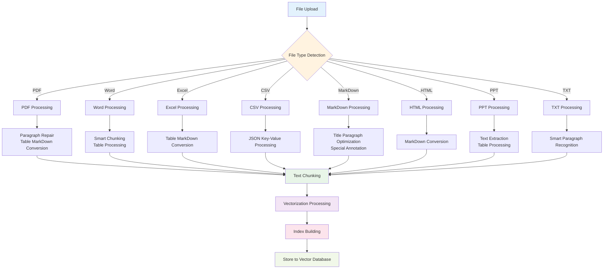

| Type | Extensions | Special Processing |
|------|------------|-------------------|
| PDF | .pdf | Paragraph repair, table MarkDown conversion |
| Word | .doc/.docx | Smart chunking, table processing |
| Excel | .xls/.xlsx | Table MarkDown conversion |
| CSV | .csv | JSON key-value processing |
| MarkDown | .md | Title paragraph optimization, special annotation |
| HTML | .html/.htm | MarkDown conversion |
| PPT | .ppt/.pptx | Text extraction, table processing |
| TXT | .txt | Smart paragraph recognition |

#### Quick Configuration

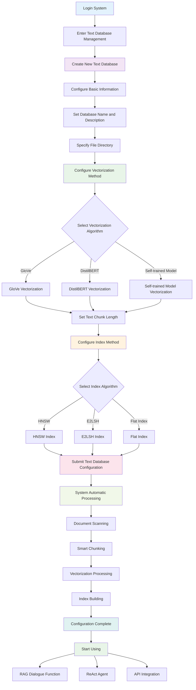

1. **Create Text Database**
   - Enter "Text Database Management" page
   - Click "Add New Text Database"
   - Configure basic information such as database name, description, and file directory

2. **Configure Vectorization Method**
   - Select vectorization method: GloVe, DistilBERT, or self-trained model
   - Set text chunk length limit
   - Configure index method: HNSW, E2LSH, or flat index

3. **Upload Documents**
   - Place documents in specified directory
   - System automatically scans, chunks, and vectorizes
   - Wait for index construction to complete

4. **Start Using**
   - Use RAG dialogue function for intelligent Q&A
   - Configure ReAct Agent for complex task automation
   - Integrate with existing systems through API interfaces

### Documentation

- [📖 System User Guide](bin/static/docs/main.md)
- [🔍 Text Database Configuration](bin/static/docs/text_db.md)
- [🤖 RAG Retrieval-Augmented Generation](bin/static/docs/rag.md)
- [🛠️ ReAct Agent Framework](bin/static/docs/react_agent.md)
- [🔧 Agent Toolset](bin/static/docs/agent_tools.md)
- [⚡ GPU Performance Optimization](bin/static/docs/gpu.md)
- [📚 Use Cases](bin/static/docs/cases/)

### Contributing

We welcome all forms of contributions! Please check [CONTRIBUTING.md](CONTRIBUTING.md) to learn how to participate in project development.

### License

This project is licensed under the GPL-3.0 License - see the [LICENSE](LICENSE) file for details.

### Contact Us

- Project Homepage: [https://github.com/ScaleFree-Tech/YiShape-VecDB](https://github.com/ScaleFree-Tech/YiShape-VecDB)
- Issue Reports: [Issues](https://github.com/ScaleFree-Tech/YiShape-VecDB/issues)
- Feature Suggestions: [Discussions](https://github.com/ScaleFree-Tech/YiShape-VecDB/discussions)

---

<div align="center">

**⭐ 如果这个项目对您有帮助，请给我们一个星标！ ⭐**

Made with ❤️ by the YiShape Team

</div>
