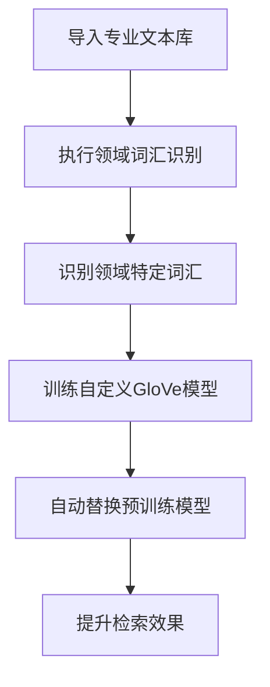
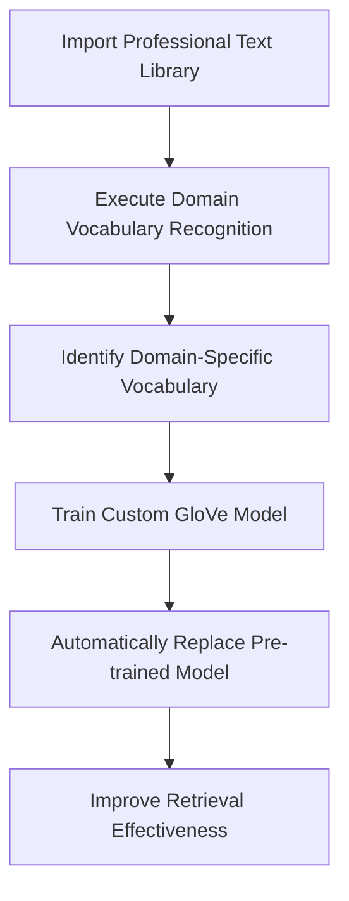

[返回](/mag/doc_detail/main)

---

# 领域词汇识别与词向量训练

> 本部分详细介绍系统内置的**领域词汇识别模型**和**GloVe词向量自定义训练**功能。这些功能专为适应垂直专业领域的独特私有知识而精心设计，能够显著提升专业文本的处理效果。

---

## 🎯 领域词汇识别

### 功能概述
中文自然语言处理以中文词组作为Token的基本单元，因此中文分词的质量直接影响后续所有文本分析任务的准确性。传统的中文分词模型往往难以识别专业、垂直领域中存在的大量领域特定词汇。

本系统的**领域词汇识别**功能专门用于：
- 🔍 识别大规模专业文本库中可能存在的领域词汇
- 📚 自动收录分词模型未覆盖的专业术语
- 🚀 提升后续分词模型和词向量训练的效果
- ⚡ 显著改善BM25检索算法的性能

### 技术特点
- **高性能模型**：内置自研的领域词汇识别模型，是目前市面上最快的识别模型之一
- **智能识别**：能够穷举所有可能的词汇组合，确保不遗漏重要领域术语
- **内存优化**：针对大规模文本库进行了内存使用优化

### ⚠️ 使用注意事项
> **内存消耗说明**：识别过程需要穷举所有可能的词汇组合，可能消耗较多内存。
> 
> **参考数据**：针对1000篇论文的识别任务约消耗10GB内存。使用前请评估数据规模和服务器内存配置。

---

## 🧠 自定义词向量库训练

### 功能说明
**自定义词向量库训练**是指基于文本库自定义训练GloVe文本向量化模型。当完成领域词汇识别后，系统内置的预训练词向量库可能无法向量化新识别的领域词汇，此时可以：

- 🎯 训练高度体现用户领域数据特点的自定义GloVe模型
- 📈 在领域文本材料上获得更好的检索效果
- 🔄 自动替换文本库的全局预训练模型

### 模型替换机制
| 文本库设置 | 模型使用情况 |
|------------|--------------|
| GloVe向量化模型 | ✅ 自动使用自定义GloVe模型 |
| DistillBert向量化模型 | ⚠️ 不受影响，仍使用原模型 |

### 技术限制说明
> **当前限制**：服务端侧暂时无法自训练DistillBert模型
> 
> **原因分析**：
> - BERT模型规模过大
> - 需要大量GPU设备集群训练
> - 服务端计算资源无法胜任

---

## 📋 使用流程

---

## 🔧 最佳实践建议

1. **数据规模评估**：使用前评估文本库大小和服务器内存配置
2. **分批处理**：对于超大规模文本库，建议分批进行识别和训练
3. **效果验证**：完成训练后，对比测试检索效果提升情况
4. **定期更新**：随着领域知识更新，定期重新训练模型

---

---

# Domain Vocabulary Recognition and Word Vector Training

> This section provides a detailed introduction to the system's built-in **Domain Vocabulary Recognition Model** and **Custom GloVe Word Vector Training** functionality. These features are specially designed to adapt to unique private knowledge in vertical professional domains, significantly improving the processing effectiveness of professional texts.

---

## 🎯 Domain Vocabulary Recognition

### Function Overview
Chinese natural language processing uses Chinese word groups as the basic units of Tokens, so the quality of Chinese word segmentation directly affects the accuracy of all subsequent text analysis tasks. Traditional Chinese word segmentation models often struggle to identify large numbers of domain-specific vocabulary that exist in professional, vertical domains.

The **Domain Vocabulary Recognition** function of this system is specifically designed to:
- 🔍 Identify domain vocabulary that may exist in large-scale professional text libraries
- 📚 Automatically include professional terms not covered by segmentation models
- 🚀 Improve the effectiveness of subsequent segmentation models and word vector training
- ⚡ Significantly enhance the performance of BM25 retrieval algorithms

### Technical Features
- **High-Performance Model**: Built-in self-developed domain vocabulary recognition model, one of the fastest recognition models currently available
- **Intelligent Recognition**: Capable of exhaustively enumerating all possible vocabulary combinations to ensure no important domain terms are missed
- **Memory Optimization**: Memory usage optimized for large-scale text libraries

### ⚠️ Usage Considerations
> **Memory Consumption Note**: The recognition process requires exhaustive enumeration of all possible vocabulary combinations, which may consume significant memory.
> 
> **Reference Data**: Recognition tasks for 1000 papers consume approximately 10GB of memory. Please evaluate data scale and server memory configuration before use.

---

## 🧠 Custom Word Vector Library Training

### Function Description
**Custom Word Vector Library Training** refers to custom training of GloVe text vectorization models based on text libraries. After completing domain vocabulary recognition, the system's built-in pre-trained word vector library may not be able to vectorize newly identified domain vocabulary. At this point, you can:

- 🎯 Train custom GloVe models that highly reflect the characteristics of user domain data
- 📈 Achieve better retrieval effects on domain text materials
- 🔄 Automatically replace the text library's global pre-trained model

### Model Replacement Mechanism
| Text Library Setting | Model Usage |
|---------------------|-------------|
| GloVe Vectorization Model | ✅ Automatically uses custom GloVe model |
| DistillBert Vectorization Model | ⚠️ Unaffected, still uses original model |

### Technical Limitations
> **Current Limitations**: Service-side custom training of DistillBert models is temporarily unavailable
> 
> **Reasons**:
> - BERT model size is too large
> - Requires large-scale GPU device cluster training
> - Service-side computing resources cannot handle the task

---

## 📋 Usage Workflow

---

## 🔧 Best Practice Recommendations

1. **Data Scale Assessment**: Evaluate text library size and server memory configuration before use
2. **Batch Processing**: For ultra-large-scale text libraries, consider batch recognition and training
3. **Effectiveness Verification**: After completing training, compare and test retrieval effectiveness improvements
4. **Regular Updates**: Re-train models periodically as domain knowledge updates

---

## 📚 Related Documentation

- [文本库管理](/mag/doc_detail/text_library)
- [检索算法配置](/mag/doc_detail/retrieval_config)
- [模型性能优化](/mag/doc_detail/model_optimization)