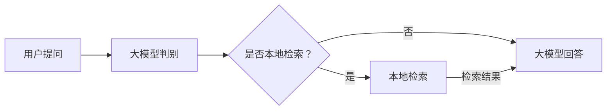
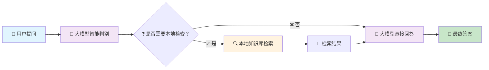
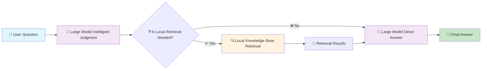

[返回](/mag/doc_detail/main)

---

# 🔍 检索增强生成（RAG）技术详解

> **检索增强生成**（Retrieval-Augmented Generation，RAG）是一种革命性的AI技术，它将传统的信息检索与大语言模型的生成能力完美结合，为用户提供更加准确、可靠和相关的智能问答服务。

## 📚 什么是RAG？

RAG技术的核心思想是通过检索本地知识库中与用户查询相关的信息，然后将检索结果作为上下文输入到大语言模型中，让大模型基于这些真实信息进行重新汇总、编排和补全，最终生成高质量的回答。

### ✨ RAG的主要优势

- **🎯 知识补全**：使用本地数据补充大模型缺失的专业知识
- **🔍 事实依据**：为大模型的回答提供可靠的事实支撑，有效缓解"幻觉"问题
- **📝 智能编排**：重新整理和提炼检索结果，生成结构化的回答

> 💡 **提示**：本系统已自动内置RAG功能，您可以在任何文本库的检索界面中使用"检索增强生成"功能。

---

## 🧠 智能问题解析机制

如[文本库及关键配置说明](/mag/doc_detail/text_db#question_parse)中介绍，由于用户的口语话表达等问题，经常出现“用户意图理解困难”问题，即系统不能使用最优的检索语句去查询用户想要获得的信息。本系统为了解决以上问题，加入了大模型解析检索问题的可选配置，位于“文本库”新增或者修改页--“用户问题解析方法”，设置为“大模型解析检索问题”后，大语言模型根据用户提出的问题决定是否需要在本地检索，如果需要检索，将转换为适合在文本库中检索的语句，然后检索，将检索结果输入大模型进行回答，流程如下图所示。

### 连续会话中的用户问题解析

相对于单次检索，连续会话中是否要对用户提问进行本地检索，以及检索什么问题，更具有挑战性。将“用户问题解析方法”设置为“大模型解析检索问题”后，在会话式RAG界面大模型将参考会话上下文和提出的问题，决定是否本地检索，及本地检索应该使用的问题。生成问题的正确性水平取决于大模型的理解能力，如果要使用会话式RAG，建议使用高水平的大语言模型。

### 检索增强生成中“数据库介绍”设置的重要性

大语言模型在根据用户提出的问题决定是否在本地文本库中检索及如何转换为合适的检索语句时，将参考文本库的介绍设置，文本库介绍的完整性将直接影响生成的检索语句的水平。例如，如果文本库中兼具中英文资料时，中文检索一般仅返回中文文本，英文检索仅返回英文文本；若能在文本库介绍中说明“xxx方面专业知识文本库，既有中文资料又有英文资料”，大模型将能根据文本库介绍同时生成中、英文检索问题，提高检索效果。另外，文本库关于涵盖内容的介绍也可以帮助大模型准确决策是否向本地文本库检索，提高会话效率。

### 带有上下文的文本块
在检索增强生成的，明确语义的小文本块切割有利于精确检索，但不利于大模型理解检索结果文本的完整含义。在检索结果中同时加载文本块的上下文（前一文本块+后一文本块），将能缓解此方面问题。在“文本库”新增或者修改页--“文本块返回类型”设置中选择“加载上下文”，能实现此功能。

---

## 🧠 智能问题解析机制详解

### 问题背景与挑战

如[文本库及关键配置说明](/mag/doc_detail/text_db#question_parse)中介绍，由于用户的口语化表达等问题，经常出现"用户意图理解困难"问题，即系统不能使用最优的检索语句去查询用户想要获得的信息。

### 智能解决方案

本系统为了解决以上问题，加入了**大模型解析检索问题**的可选配置，位于"文本库"新增或者修改页面的"用户问题解析方法"设置项。

当设置为"大模型解析检索问题"后，系统将执行以下智能流程：

1. **🎯 智能判别**：大语言模型分析用户问题，判断是否需要进行本地检索
2. **🔄 问题转换**：如需要检索，自动转换为适合在文本库中检索的优化语句
3. **🔍 智能检索**：执行检索操作并获取相关结果
4. **💬 生成回答**：将检索结果输入大模型，生成最终答案

### 🔄 优化后的工作流程图

---

## 💬 连续会话中的智能解析

### 挑战与机遇

相对于单次检索，连续会话中是否要对用户提问进行本地检索，以及检索什么问题，更具有挑战性。系统需要：

- **🧠 上下文理解**：准确理解整个对话的上下文关系
- **🔗 问题关联**：判断当前问题是否需要检索历史信息
- **📋 检索策略**：决定检索什么内容以及如何检索

### 智能决策机制

将"用户问题解析方法"设置为"大模型解析检索问题"后，在会话式RAG界面中，大模型将：

1. **📊 综合分析**：结合会话上下文和当前提出的问题
2. **🎯 智能判断**：决定是否需要进行本地检索
3. **🔄 问题优化**：生成最适合的检索查询语句

> ⚠️ **重要提醒**：生成问题的正确性水平取决于大模型的理解能力。如果要使用会话式RAG，建议使用高水平的大语言模型以获得最佳体验。

---

## 🗃️ 数据库介绍设置的重要性

### 核心作用

大语言模型在根据用户提出的问题决定是否在本地文本库中检索及如何转换为合适的检索语句时，将参考**文本库的介绍设置**，文本库介绍的完整性将直接影响生成的检索语句的水平。

### 实际应用示例

#### 🌍 多语言支持场景
- **场景描述**：如果文本库中兼具中英文资料时，中文检索一般仅返回中文文本，英文检索仅返回英文文本
- **设置建议**：若能在文本库介绍中说明"xxx方面专业知识文本库，既有中文资料又有英文资料"
- **预期效果**：大模型将能根据文本库介绍同时生成中、英文检索问题，显著提高检索效果

#### 📚 内容范围说明
- **设置建议**：详细描述文本库涵盖的专业领域、内容类型、时间范围等
- **预期效果**：帮助大模型准确决策是否向本地文本库检索，提高会话效率，避免无效检索

---

## 📖 上下文感知的文本块

### 技术挑战

在检索增强生成中，明确语义的小文本块切割有利于精确检索，但不利于大模型理解检索结果文本的完整含义。

### 智能解决方案

本系统提供了**上下文加载**功能来解决这一问题：

1. **📍 功能位置**：在"文本库"新增或者修改页面的"文本块返回类型"设置中
2. **⚙️ 选择选项**：选择"加载上下文"
3. **🔧 工作原理**：在检索结果中同时加载文本块的上下文（前一文本块 + 后一文本块）

### 🎯 预期效果

- **📝 语义完整性**：大模型能够更好地理解检索内容的完整含义
- **🔗 上下文关联**：准确把握文本之间的逻辑关系和连贯性
- **✨ 回答质量**：生成更加准确、连贯和有用的回答

---

## 🚀 最佳实践建议

### ⚙️ 配置优化
1. **启用智能解析**：建议开启"大模型解析检索问题"功能
2. **完善库介绍**：详细描述文本库的内容范围和特点
3. **启用上下文**：选择"加载上下文"以提升理解效果

### 🤖 模型选择
- 优先选择性能优异的大语言模型
- 确保模型具备良好的中文理解和生成能力

### 📊 内容管理
- 定期更新和维护文本库内容
- 确保文本块切割的合理性
- 保持知识库的时效性和准确性

---

---

# 🔍 Retrieval-Augmented Generation (RAG) Technology Guide

> **Retrieval-Augmented Generation (RAG)** is a revolutionary AI technology that perfectly combines traditional information retrieval with the generative capabilities of large language models, providing users with more accurate, reliable, and relevant intelligent Q&A services.

## 📚 What is RAG?

The core idea of RAG technology is to retrieve information relevant to user queries from local knowledge bases, then input these retrieval results as context into large language models, allowing the models to reorganize, compile, and complete based on this authentic information, ultimately generating high-quality answers.

### ✨ Key Advantages of RAG

- **🎯 Knowledge Completion**: Use local data to supplement missing professional knowledge in large models
- **🔍 Factual Basis**: Provide reliable factual support for model answers, effectively mitigating "hallucination" issues
- **📝 Intelligent Compilation**: Reorganize and refine retrieval results to generate structured answers

> 💡 **Tip**: This system has automatically built-in RAG functionality. You can use "Retrieval-Augmented Generation" in any text library's search interface.

---

## 🧠 Intelligent Question Parsing Mechanism

### Problem Background

As described in [Text Library and Key Configuration Instructions](/mag/doc_detail/text_db#question_parse), due to the diversity of user expression methods and colloquial characteristics, the system often faces the challenge of "difficulty in understanding user intent," unable to use optimal search statements to obtain the information users truly need.

### Solution

To address this issue, this system introduces an optional configuration for **Large Model Intelligent Parsing of Search Questions**. You can find the "User Question Parsing Method" setting on the "Text Library" add or modify page.

When set to "Large Model Parsing of Search Questions," the system will:

1. **Intelligent Judgment**: Large language models analyze user questions to determine whether local retrieval is needed
2. **Question Conversion**: If retrieval is needed, automatically convert to optimized statements suitable for searching in the text library
3. **Intelligent Retrieval**: Execute retrieval operations and obtain relevant results
4. **Generate Answers**: Input retrieval results into the large model to generate final answers

### 🔄 Workflow Diagram

---

## 💬 Intelligent Parsing in Continuous Conversations

### Challenges and Opportunities

Compared to single retrieval, RAG applications in continuous conversations are more challenging. The system needs to:

- **Context Understanding**: Accurately understand the context of the entire conversation
- **Question Association**: Judge whether current questions need to retrieve historical information
- **Retrieval Strategy**: Decide what content to retrieve and how to retrieve it

### Intelligent Decision Mechanism

When the "Large Model Parsing of Search Questions" function is enabled, in the conversational RAG interface, the large model will:

1. **Comprehensive Analysis**: Combine conversation context and current questions
2. **Intelligent Judgment**: Decide whether local retrieval is needed
3. **Question Optimization**: Generate the most suitable retrieval query statements

> ⚠️ **Important Reminder**: The accuracy of generated questions highly depends on the large model's understanding ability. It's recommended to choose high-performance large language models when using conversational RAG for the best experience.

---

## 🗃️ Importance of Database Introduction Settings

### Core Role

When large language models decide whether to perform local retrieval and how to convert search statements, they will reference the **Text Library Introduction Settings**. The completeness of this setting directly affects the quality of retrieval statements and retrieval effectiveness.

### Practical Application Examples

#### Multi-language Support
- **Scenario**: Text library contains Chinese and English materials
- **Setting Suggestion**: Clearly state in the introduction "This library is a xxx professional field knowledge base, covering bilingual materials in Chinese and English"
- **Effect**: Large models will be able to generate both Chinese and English retrieval questions simultaneously, significantly improving retrieval coverage and accuracy

#### Content Scope Description
- **Setting Suggestion**: Detailed description of the professional fields, content types, time ranges, etc. covered by the text library
- **Effect**: Help large models accurately determine whether to search local knowledge bases, improve conversation efficiency, and avoid ineffective retrieval

---

## 📖 Context-Aware Text Blocks

### Technical Challenges

In RAG systems, precise text block cutting is beneficial for improving retrieval accuracy, but it also brings new challenges: large models may have difficulty understanding the complete meaning and contextual relationships of retrieved result texts.

### Solution

This system provides a **Context Loading** function to solve this problem:

1. **Function Location**: Find the "Text Block Return Type" setting on the "Text Library" add or modify page
2. **Selection Option**: Choose "Load Context"
3. **Working Principle**: Simultaneously load the context before and after text blocks in retrieval results (previous text block + next text block)

### 🎯 Expected Effects

- **Semantic Completeness**: Large models can better understand the complete meaning of retrieved content
- **Context Association**: Accurately grasp the logical relationships and coherence between texts
- **Answer Quality**: Generate more accurate, coherent, and useful answers

---

## 🚀 Best Practice Recommendations

### Configuration Optimization
1. **Enable Intelligent Parsing**: Recommend enabling the "Large Model Parsing of Search Questions" function
2. **Complete Library Introduction**: Detailed description of the text library's content scope and characteristics
3. **Enable Context**: Choose "Load Context" to improve understanding effectiveness

### Model Selection
- Prioritize high-performance large language models
- Ensure models have good Chinese understanding and generation capabilities

### Content Management
- Regularly update and maintain text library content
- Ensure reasonable text block cutting
- Maintain the timeliness and accuracy of knowledge bases
