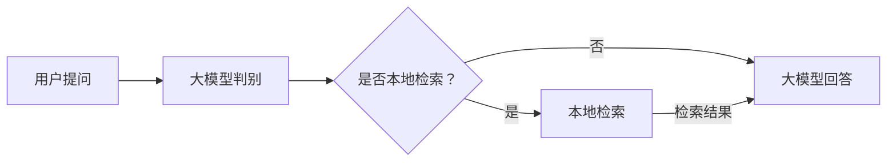

[返回](/mag/doc_detail/main)

---

## 面向大语言模型的检索增强生成（RAG）

检索增强生成（Retrieval-Augmented Generation，RAG）是一种结合文本库的"信息检索（Retrieval）"和大语言模型的"生成（Generation）功能"的技术，旨在提升大模型生成内容的相关性、准确性和可靠性。其核心思想是通过检索本地文本库中与用户查询相关的信息，将检索结果输入大语言模型，大模型进行重新汇总、编排、补全后生成回答。使用检索增强生成的主要优点包括：

- 使用本地数据补全大模型缺失的知识。
- 为大模型的回答提供事实依据，缓解大模型幻觉问题。
- 重新编排和提炼检索结果。

本系统的文本库自动内置了“检索增强生成”功能，在文本库的检索界面均可进行“检索增强生成”操作。

### 用户问题解析方法

如[文本库及关键配置说明](/mag/doc_detail/text_db#question_parse)中介绍，由于用户的口语话表达等问题，经常出现“用户意图理解困难”问题，即系统不能使用最优的检索语句去查询用户想要获得的信息。本系统为了解决以上问题，加入了大模型解析检索问题的可选配置，位于“文本库”新增或者修改页--“用户问题解析方法”，设置为“大模型解析检索问题”后，大语言模型根据用户提出的问题决定是否需要在本地检索，如果需要检索，将转换为适合在文本库中检索的语句，然后检索，将检索结果输入大模型进行回答，流程如下图所示。

### 连续会话中的用户问题解析

相对于单次检索，连续会话中是否要对用户提问进行本地检索，以及检索什么问题，更具有挑战性。将“用户问题解析方法”设置为“大模型解析检索问题”后，在会话式RAG界面大模型将参考会话上下文和提出的问题，决定是否本地检索，及本地检索应该使用的问题。生成问题的正确性水平取决于大模型的理解能力，如果要使用会话式RAG，建议使用高水平的大语言模型。

### 检索增强生成中“数据库介绍”设置的重要性

大语言模型在根据用户提出的问题决定是否在本地文本库中检索及如何转换为合适的检索语句时，将参考文本库的介绍设置，文本库介绍的完整性将直接影响生成的检索语句的水平。例如，如果文本库中兼具中英文资料时，中文检索一般仅返回中文文本，英文检索仅返回英文文本；若能在文本库介绍中说明“xxx方面专业知识文本库，既有中文资料又有英文资料”，大模型将能根据文本库介绍同时生成中、英文检索问题，提高检索效果。另外，文本库关于涵盖内容的介绍也可以帮助大模型准确决策是否向本地文本库检索，提高会话效率。

### 带有上下文的文本块

在检索增强生成的，明确语义的小文本块切割有利于精确检索，但不利于大模型理解检索结果文本的完整含义。在检索结果中同时加载文本块的上下文（前一文本块+后一文本块），将能缓解此方面问题。在“文本库”新增或者修改页--“文本块返回类型”设置中选择“加载上下文”，能实现此功能。