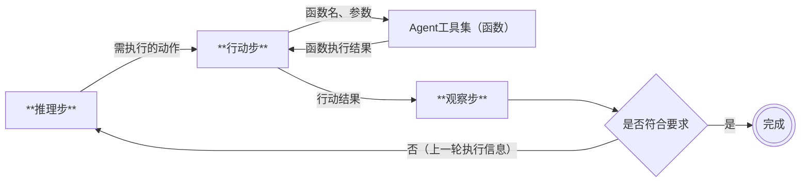

[返回](/mag/doc_detail/main)

---

## ReAct Agent

系统内置了ReAct Agent的完整实现，这是文本型向量库的核心扩展功能之一。ReAct Agent的核心在于将推理和行动紧密结合起来，通过外部的数据和功能加强大模型的能力。在动态和不确定的环境中，有效的决策需要持续的学习和适应，以及快速将推理转化为行动的能力，即形成有效的观察—思考—行动—再观察的循环。

ReAct Agent的执行流程如下图所示：

ReAct Agent也是克服大语言模型幻觉（通过自动化本地文本库和WEB搜索为大模型回答提供事实依据）和增加大模型多模态能力（调用外部的图片生成函数）的关键框架。据调查，文心一言、豆包、Kimi的大模型用户接口事实上均为ReAct Agent。

**快捷链接**

- [ReAct Agent设置](/mag/list_react_agent)
- [ReAct Agent用户端](/user/user_list_react_agent)
- [Agent工具集](/mag/list_agent_tool)