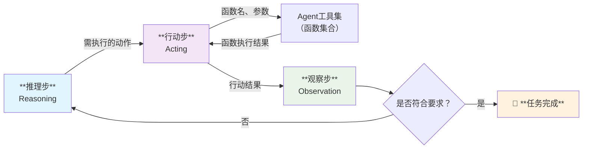
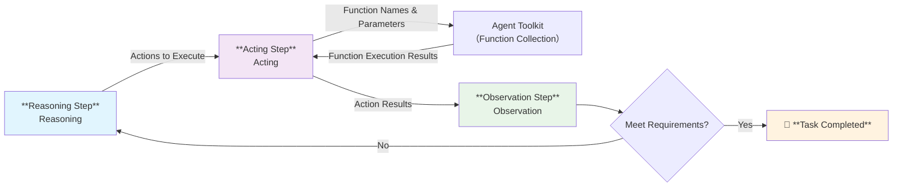

[返回](/mag/doc_detail/main)

---

# ReAct Agent 智能代理系统

## 概述

YiShape 系统内置了完整的 **ReAct Agent** 实现，这是文本型向量库的核心扩展功能之一。ReAct Agent 的核心优势在于将**推理（Reasoning）**和**行动（Acting）**紧密结合起来，通过外部的数据和功能显著增强大语言模型的能力。

在动态和不确定的环境中，有效的决策需要：
- 🔄 **持续的学习和适应能力**
- ⚡ **快速将推理转化为行动的能力**
- 🔁 **形成有效的观察—思考—行动—再观察循环**

## 核心执行流程

ReAct Agent 的执行流程遵循以下循环模式：

## 核心优势

### 🎯 **克服大语言模型幻觉**
- 通过自动化本地文本库检索
- 集成 WEB 搜索功能
- 为大模型回答提供可靠的事实依据

### 🚀 **增强多模态能力**
- 调用外部图片生成函数
- 支持图像处理和分析
- 扩展大模型的感知边界

### 💡 **行业应用现状**
据调查，主流大模型平台如**文心一言**、**豆包**、**Kimi** 的用户接口均采用 ReAct Agent 架构，证明了该框架的先进性和实用性。

## 快速导航

- 🔧 **[ReAct Agent 设置管理](/mag/list_react_agent)**
- 👥 **[ReAct Agent 用户端](/user/user_list_react_agent)**
- 🛠️ **[Agent 工具集管理](/mag/list_agent_tool)**

---

## English Version

# ReAct Agent Intelligent System

## Overview

YiShape system comes with a complete **ReAct Agent** implementation, which is one of the core extension features of the text-based vector database. The core advantage of ReAct Agent lies in tightly coupling **Reasoning** and **Acting**, significantly enhancing large language model capabilities through external data and functions.

In dynamic and uncertain environments, effective decision-making requires:
- 🔄 **Continuous learning and adaptation capabilities**
- ⚡ **Rapid conversion of reasoning into action**
- 🔁 **Formation of effective Observe-Think-Act-Reobserve cycles**

## Core Execution Flow

ReAct Agent follows the following cyclic pattern:

## Core Advantages

### 🎯 **Overcoming LLM Hallucinations**
- Automated local text database retrieval
- Integrated WEB search functionality
- Providing reliable factual basis for LLM responses

### 🚀 **Enhanced Multimodal Capabilities**
- Calling external image generation functions
- Supporting image processing and analysis
- Expanding LLM perceptual boundaries

### 💡 **Industry Application Status**
According to research, mainstream LLM platforms such as **Wenxin Yiyan**, **Doubao**, and **Kimi** all adopt ReAct Agent architecture in their user interfaces, demonstrating the framework's advancement and practicality.

## Quick Navigation

- 🔧 **[ReAct Agent Settings Management](/mag/list_react_agent)**
- 👥 **[ReAct Agent User Interface](/user/user_list_react_agent)**
- 🛠️ **[Agent Toolkit Management](/mag/list_agent_tool)**

